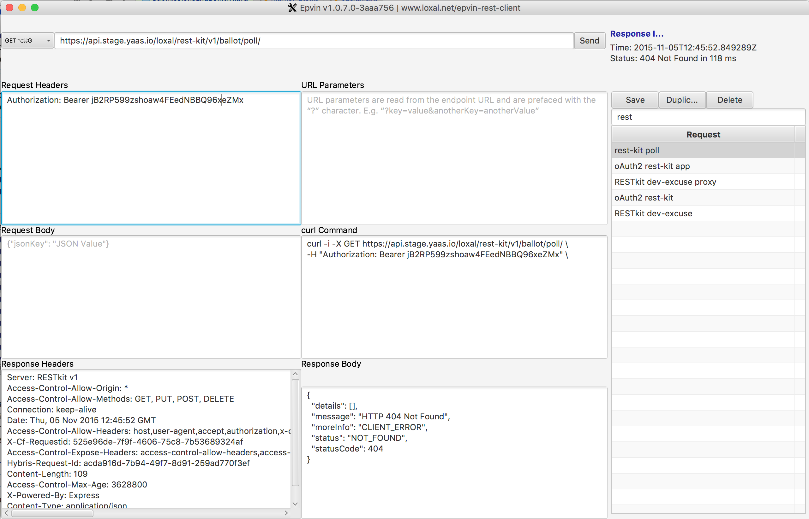

# DEV Status

**Support this project**
<!-- BADGES/ -->

<!-- /BADGES -->
REST Client
===========

# Run It

`./run.sh`

* As Oracle extended the JavaFX API in JDK v1.8.0_40, at least `JDK v1.8.0_40` is required to build this app.

# This is How it Looks Like

